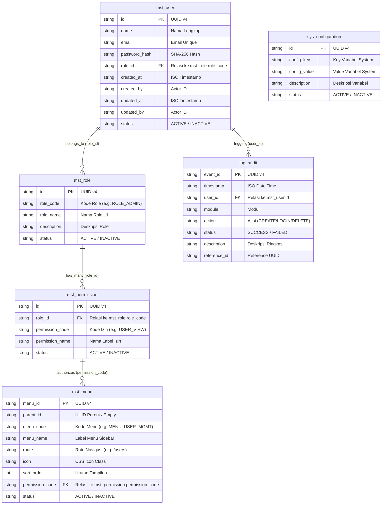

# Design Specification Document (DESIGN.MD) - AppScript Enterprise Framework (AEF)

Dokumen ini berisi spesifikasi desain sistem, arsitektur UI/UX (Metronic UI Light Theme), model data relasional (ERD), serta spesifikasi detail **Fitur CRUD (Create, Read, Update, Delete)** untuk seluruh modul di **AppScript Enterprise Framework (AEF)**.

---

## 1. Design System & Metronic UI Light Aesthetics

Aplikasi AEF menggunakan filosofi desain **Metronic UI Light Model** dengan palet warna, tipografi, dan komponen visual modern berikut:

### 🎨 Palet Warna (Color Palette)
- **Canvas Background**: `#f5f8fa` (Light Slate Soft Canvas)
- **Card & Surface Background**: `#ffffff` (Pure White Card)
- **Primary Color**: `#009ef7` (Metronic Vivid Blue)
- **Primary Hover**: `#0086d1`
- **Dark Text (Headings)**: `#181c32` (Crisp Dark Charcoal)
- **Body Text**: `#3f4254` (Readable Medium Dark)
- **Muted Text**: `#a1a5b7` (Subtle Muted Gray)
- **Border Line**: `#e4e6ef` (Soft Separator Line)

### 🏷️ Metronic Soft Pastel Badges
- **Primary Badge** (`.badge-light-primary`): Background `#f8f5ff`, Text `#7239ea` (Indigo / Kode Role & Permission)
- **Success Badge** (`.badge-light-success`): Background `#e8fff3`, Text `#50cd89` (Pastel Green / Status ACTIVE / SUCCESS)
- **Danger Badge** (`.badge-light-danger`): Background `#fff5f8`, Text `#f1416c` (Pastel Red / Status INACTIVE / FAILED)
- **Info Badge** (`.badge-light-info`): Background `#f1faff`, Text `#009ef7` (Pastel Blue)
- **Warning Badge** (`.badge-light-warning`): Background `#fff8dd`, Text `#ffc700` (Pastel Yellow)

### 🔤 Tipografi & Layout Shell
- **Font Family**: Google Fonts `Inter` (Weights: 300, 400, 500, 600, 700)
- **Header Bar**: Tinggi 70px, fixed top, background `#ffffff`, border-bottom `#e4e6ef`.
- **Sidebar**: Lebar 260px, fixed left (top 70px), background `#ffffff`, border-right `#e4e6ef`.
- **Main Canvas Wrapper**: Margin-top 70px, margin-left 260px, padding 2rem.

---

## 2. Model Data Relasional (ERD)

Aplikasi AEF menggunakan Spreadsheet Google sebagai basis data relasional terstruktur:



---

## 3. Matriks Spesifikasi Detail Fitur CRUD (Create, Read, Update, Delete)

Tabel berikut menentukan spesifikasi teknis eksekusi CRUD untuk setiap modul AEF:

| Modul | Operasi CRUD | Komponen UI / Modal | Inputan Form & Field | API Endpoint (`google.script.run`) | Target Sheet Database | Audit Log Trigger Code |
| :--- | :--- | :--- | :--- | :--- | :--- | :--- |
| **User Mgmt** | **CREATE** | Modal `#addUserModal` | • `name` (Text) <br> • `email` (Email) <br> • `password` (Password) <br> • `role_id` (Select) | `apiCreateUser` | `mst_user.appendRow` | `USER_CREATE_SUCCESS` |
| **User Mgmt** | **READ** | Tabel `#users-table-body` | *Pagination (5/page)* | `apiGetUsers` | `mst_user.readAll` | - |
| **User Mgmt** | **UPDATE** | Modal `#editUserModal` | • `edit-user-id` (Hidden) <br> • `name` (Text) <br> • `email` (Email) <br> • `role_id` (Select) <br> • `password` (Optional) | `apiUpdateUser` | `BaseRepository.updateById` | `USER_UPDATE_SUCCESS` |
| **User Mgmt** | **DELETE** | Tombol Trash | • `userId` (Parameter) | `apiDeleteUser` | Soft Delete (`status = INACTIVE`) | `USER_DELETE_SUCCESS` |
| **Role Mgmt** | **CREATE** | Modal `#addRoleModal` | • `role_code` (Text) <br> • `role_name` (Text) <br> • `description` (Textarea) | `apiCreateRole` | `mst_role.appendRow` | `ROLE_CREATE_SUCCESS` |
| **Role Mgmt** | **READ** | Tabel `#roles-table-body` | *Pagination (5/page)* | `apiGetRoles` | `mst_role.readAll` | - |
| **Role Mgmt** | **DELETE** | Tombol Trash | • `role_id` (Parameter) | `apiDeleteRole` | Soft Delete (`status = INACTIVE`) | `ROLE_DELETE_SUCCESS` |
| **Permission**| **CREATE** | Modal `#addPermModal` | • `role_id` (Select) <br> • `permission_code` (Text) <br> • `permission_name` (Text) | `apiCreatePermission` | `mst_permission.appendRow` | `PERMISSION_CREATE_SUCCESS` |
| **Permission**| **READ** | Tabel `#perms-table-body` | *Pagination (5/page)* | `apiGetPermissions` | `mst_permission.readAll` | - |
| **Permission**| **DELETE** | Tombol Trash | • `perm_id` (Parameter) | `apiDeletePermission` | Soft Delete (`status = INACTIVE`) | `PERMISSION_DELETE_SUCCESS` |
| **Config** | **READ** | Tabel `#configs-table-body`| *Pagination (5/page)* | `apiGetConfigs` | `sys_configuration.readAll` | - |
| **Config** | **UPDATE** | Modal `#editConfigModal`| • `edit-config-id` (Hidden) <br> • `config_value` (Text) | `apiUpdateConfig` | `BaseRepository.updateById` | `CONFIG_UPDATE_SUCCESS` |
| **Audit Logs**| **READ** | Tabel `#audit-table-body` | *Pagination (5/page)* | `apiGetAuditLogs` | `log_audit.getRecentLogs` | - |

---

## 4. Desain Wireframe UI & Komponen CRUD per Fitur

### 🔐 Fitur 1: Login Shell (`/login`)
* **Tujuan**: Otentikasi pengguna dengan enkripsi SHA-256 dan pembuatan sesi `CacheService`.
* **Wireframe**:
  ```
  +-------------------------------------------------------+
  |                   [ AEF Icon ]                        |
  |             AppScript Enterprise                      |
  |          Sign In to Access Dashboard                  |
  |                                                       |
  |  Email Address                                        |
  |  [ admin@aef.com                                   ]  |
  |                                                       |
  |  Password                                             |
  |  [ ••••••••                                        ]  |
  |                                                       |
  |  [              Sign In Button                     ]  |
  +-------------------------------------------------------+
  ```

---

### 📊 Fitur 2: Dashboard (`/dashboard`)
* **Tujuan**: Visualisasi ringkasan statistik dan grafik tren aktivitas sistem.
* **Wireframe**:
  ```
  +--------------------+  +--------------------+  +--------------------+  +--------------------+
  | Total Users        |  | Active Roles       |  | Audit Logs         |  | App Version        |
  | 2 Users            |  | 2 Roles            |  | 15 Logs            |  | v1.0.0             |
  +--------------------+  +--------------------+  +--------------------+  +--------------------+

  +-----------------------------------------------------------------------------------------------+
  | System Activity Trend (Chart.js Canvas)                                                      |
  | [ Line Chart displaying login and CRUD activity over time ]                                   |
  +-----------------------------------------------------------------------------------------------+
  ```

---

### 👥 Fitur 3: User Management (`/users`) - [FULL CRUD]
* **Wireframe Interface**:
  ```
  User Management                             [ + Tambah User ]
  -----------------------------------------------------------
  +---------------------------------------------------------+
  | Nama Lengkap  | Email        | Role ID    | Status | Aksi|
  +---------------+--------------+------------+--------+-----+
  | Administrator | admin@aef.com| ROLE_ADMIN | ACTIVE | [E][D]
  | Standard User | user@aef.com | ROLE_USER  | ACTIVE | [E][D]
  +---------------------------------------------------------+
  Showing 1 to 2 of 2 entries            [Prev] [1] [Next]
  ```
* **Rincian Modal CRUD**:
  - **Modal Tambah User (`#addUserModal`)**:
    - Field 1: `Nama Lengkap` (`#new-user-name`) - Text Input (Required)
    - Field 2: `Email Address` (`#new-user-email`) - Email Input (Required, Unique)
    - Field 3: `Password` (`#new-user-password`) - Password Input (Required, Enkripsi SHA-256)
    - Field 4: `Role` (`#new-user-role`) - Select Dropdown (`ROLE_USER` / `ROLE_ADMIN`)
    - Action: `AEF.createUser()` $\rightarrow$ API `apiCreateUser`.
  - **Modal Edit User (`#editUserModal`)**:
    - Field 1: `Hidden User ID` (`#edit-user-id`)
    - Field 2: `Nama Lengkap` (`#edit-user-name`) - Text Input
    - Field 3: `Email Address` (`#edit-user-email`) - Email Input
    - Field 4: `Role` (`#edit-user-role`) - Select Dropdown
    - Field 5: `Password Baru (Opsional)` (`#edit-user-password`) - Diisi jika mereset password.
    - Action: `AEF.submitUpdateUser()` $\rightarrow$ API `apiUpdateUser`.

---

### 🛡️ Fitur 4: Role Management (`/roles`) - [FULL CRUD]
* **Wireframe Interface**:
  ```
  Role Management                             [ + Tambah Role ]
  -----------------------------------------------------------
  +---------------------------------------------------------+
  | Role Code  | Nama Role         | Deskripsi       | Status| Aksi|
  +------------+-------------------+-----------------+-------+-----+
  | ROLE_ADMIN | Administrator     | Full Access     | ACTIVE| [D] |
  | ROLE_USER  | Standard User     | Standard Access | ACTIVE| [D] |
  +---------------------------------------------------------+
  Showing 1 to 2 of 2 entries            [Prev] [1] [Next]
  ```
* **Rincian Modal CRUD**:
  - **Modal Tambah Role (`#addRoleModal`)**:
    - Field 1: `Role Code` (`#new-role-code`) - Text Input (Required, Uppercase, e.g. `ROLE_MANAGER`)
    - Field 2: `Nama Role` (`#new-role-name`) - Text Input (Required)
    - Field 3: `Deskripsi` (`#new-role-desc`) - Textarea Input
    - Action: `AEF.createRole()` $\rightarrow$ API `apiCreateRole`.

---

### 🔑 Fitur 5: Permission Control (`/permissions`) - [FULL CRUD]
* **Wireframe Interface**:
  ```
  Permission Control                          [ + Tambah Perm ]
  -----------------------------------------------------------
  +---------------------------------------------------------+
  | Role ID    | Permission Code | Nama Permission   | Status| Aksi|
  +------------+-----------------+-------------------+-------+-----+
  | ROLE_ADMIN | DASHBOARD_VIEW  | View Dashboard    | ACTIVE| [D] |
  | ROLE_ADMIN | USER_VIEW       | View Users        | ACTIVE| [D] |
  +---------------------------------------------------------+
  Showing 1 to 2 of 2 entries            [Prev] [1] [Next]
  ```
* **Rincian Modal CRUD**:
  - **Modal Tambah Permission (`#addPermModal`)**:
    - Field 1: `Target Role ID` (`#new-perm-role`) - Text/Select Input
    - Field 2: `Permission Code` (`#new-perm-code`) - Text Input (Uppercase, e.g. `REPORT_VIEW`)
    - Field 3: `Nama Label` (`#new-perm-name`) - Text Input
    - Action: `AEF.createPermission()` $\rightarrow$ API `apiCreatePermission`.

---

### ⚙️ Fitur 6: System Configuration (`/config`) - [FULL CRUD]
* **Wireframe Interface**:
  ```
  System Configuration
  -----------------------------------------------------------
  +---------------------------------------------------------+
  | Config Key       | Config Value     | Deskripsi   | Aksi |
  +------------------+------------------+-------------+------+
  | APP_NAME         | AEF Framework    | App Name    | [Edit|
  | APP_VERSION      | 1.0.0            | App Version | [Edit|
  +---------------------------------------------------------+
  Showing 1 to 2 of 2 entries            [Prev] [1] [Next]
  ```
* **Rincian Modal CRUD**:
  - **Modal Edit Config (`#editConfigModal`)**:
    - Field 1: `Hidden Config ID` (`#edit-config-id`)
    - Field 2: `Config Key` (`#edit-config-key`) - Text Input (Readonly)
    - Field 3: `Config Value` (`#edit-config-value`) - Text Input (Editable Value)
    - Action: `AEF.submitUpdateConfig()` $\rightarrow$ API `apiUpdateConfig`.

---

### 📜 Fitur 7: Audit Trail Logs (`/audit`) - [READ & REFRESH]
* **Wireframe Interface**:
  ```
  Audit Trail Logs                            [ Refresh Logs ]
  -----------------------------------------------------------
  +---------------------------------------------------------------+
  | Waktu      | Module | Action/Status | User ID | Deskripsi| Ref|
  +------------+--------+---------------+---------+----------+----+
  | 2026-08-14 | AUTH   | LOGIN_SUCCESS | USR-001 | Login ok | 550|
  +---------------------------------------------------------------+
  Showing 1 to 5 of 15 entries            [Prev] [1] [2] [Next]
  ```

---

## 5. Arsitektur Data Flow & API Routing

Seluruh komunikasi frontend ke backend menggunakan **Strict 5-Layer Pattern**:

$$\text{Client Browser (UI)} \xrightarrow{\text{google.script.run}} \text{ApiController (.gs)} \xrightarrow{\text{Service Layer}} \xrightarrow{\text{Audit Logging}} \text{BaseRepository (Batch Memory I/O)} \xrightarrow{\text{Google Sheet DB}}$$

1. **Standard Response**: Mengembalikan JSON `{ success, code, message, data, errors, reference_id }`.
2. **Audit Logging**: Merekam log `log_audit` secara terpusat untuk setiap aksi sensitive.
3. **Memory-First I/O**: Membaca dan menulis sheet sekaligus via `getDataRange().getValues()` untuk kecepatan tinggi.
