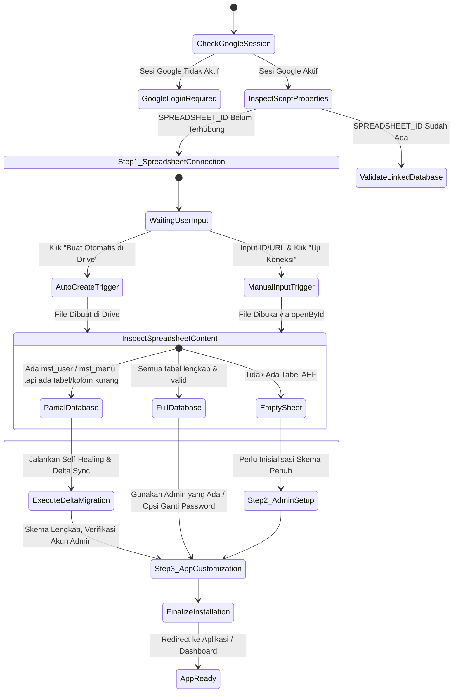

# Product Requirement Document (PRD)
## Mekanisme Instalasi & Migrasi Database Multi-Skenario
### AppScript Enterprise Framework (AEF)

---

## 1. PENDAHULUAN & TUJUAN

Dokumen ini merinci arsitektur, alur kerja, dan spesifikasi fungsional untuk **Mekanisme Instalasi & Migrasi Database AEF** yang dirancang untuk mendukung dua skenario utama secara mulus (*seamless*), aman (*non-destructive*), dan ramah pengguna (*developer & end-user friendly*):

1. **Skenario 1: Akun Google Baru (Fresh Installation)**
   Pengguna baru atau proyek baru yang belum memiliki database AEF di Google Drive.
2. **Skenario 2: Akun Google / Spreadsheet yang Sudah Terinstall (Existing Installation / Re-link / Migration)**
   Pengguna yang sudah memiliki database AEF, ingin menghubungkan kembali (*re-link*) spreadsheet yang sudah ada, atau melakukan migrasi saat ada modul/tabel baru (misal: `mst_project`).

---

## 2. PRINSIP DESAIN INSTALASI

1. **Zero Data Loss (Non-Destructive)**:
   Sistem **DILARANG KERAS** menghapus (*wipe/clear*) spreadsheet yang sudah memiliki data operasional saat proses instalasi atau sinkronisasi.
2. **Deterministic State Detection**:
   Sistem harus mampu mendeteksi secara akurat kondisi akun Google dan status spreadsheet yang dihubungkan:
   - Apakah sesi Google aktif?
   - Apakah Spreadsheet ID valid dan memiliki izin *Editor*?
   - Apakah spreadsheet kosong, sebagian terpasang (*partial/outdated*), atau sudah terpasang penuh (*ready*)?
3. **Dual Provisioning Mode**:
   Menyediakan dua metode fleksibel:
   - **Mode Otomatis**: Buat folder dan spreadsheet baru secara instan di Google Drive.
   - **Mode Manual**: Hubungkan spreadsheet yang sudah ada menggunakan Spreadsheet ID atau Google Sheet URL.
4. **Self-Healing & Delta Migration**:
   Jika database yang dihubungkan adalah versi lama atau belum memiliki tabel modul baru (contoh: `mst_project`), sistem otomatis melakukan migrasi delta: membuat tabel baru, menambahkan hak akses/permission baru ke role admin, dan mendaftarkan menu baru tanpa merusak data lama.

---

## 3. STATE MACHINE INSTALASI



---

## 4. SKENARIO 1: FRESH INSTALLATION (AKUN GOOGLE BARU)

### 4.1 Kondisi Awal
- Script dijalankan pada Akun Google baru.
- `ScriptProperties.getProperty('SPREADSHEET_ID')` bernilai `null` atau kosong.
- Tidak ada folder `"AEF App Database"` di Google Drive pengguna.

### 4.2 Alur Pengguna (User Flow)
1. **Akses Web App**: Pengguna membuka URL deployment Apps Script.
2. **Deteksi Sesi**: Sistem memverifikasi sesi login Akun Google via `Session.getActiveUser().getEmail()`.
3. **Penyajian Wizard Langkah 1 (Koneksi Database)**:
   - Pengguna disajikan dua opsi:
     - **Opsi A (Rekomendasi Cepat)**: Klik *"Buat Spreadsheet Baru Otomatis di Drive"*. Sistem membuat folder `"AEF App Database"` dan spreadsheet `"AEF Enterprise Database File"`.
     - **Opsi B (Manual)**: Masukkan Spreadsheet ID dari Google Spreadsheet yang telah dibuat sebelumnya, lalu klik *"Uji Koneksi"*.
4. **Langkah 2: Konfigurasi Akun Super Admin**:
   - Form isian: Nama Lengkap, Username, Email (otomatis terisi email Google aktif), No. HP, Password Admin.
5. **Langkah 3: Kustomisasi Aplikasi**:
   - Form isian: Nama Aplikasi (`APP_NAME`), Kode Prefix (`APP_CODE`), URL Logo (`APP_LOGO`).
6. **Eksekusi Inisialisasi**:
   - Membuat 7 tabel standar AEF:
     1. `mst_user` (Dilengkapi akun Super Admin, Admin, dan Standard User).
     2. `mst_role` (`ROLE_SUPER_ADMIN`, `ROLE_ADMIN`, `ROLE_USER`).
     3. `mst_permission` (Seluruh permission standar sistem + modul project).
     4. `mst_menu` (Hierarki modul Dashboard, Master Data, System Settings).
     5. `sys_configuration` (Konfigurasi aplikasi & timeout).
     6. `log_audit` (Tabel pencatatan audit log).
     7. `mst_project` (Tabel master project management + 4 seed projects).
   - Menyimpan `SPREADSHEET_ID`, `APP_NAME`, `APP_CODE`, `APP_LOGO` ke `ScriptProperties`.
7. **Selesai**: Halaman me-reload otomatis dan menampilkan halaman Login / Dashboard.

---

## 5. SKENARIO 2: EXISTING INSTALLATION / RE-LINK / MIGRATION (AKUN SUDAH TERINSTALL)

### 5.1 Kondisi Awal
- Pengguna memasukkan Spreadsheet ID yang **sudah pernah digunakan sebelumnya**, ATAU
- Pengguna memperbarui kode aplikasi ke versi baru yang memiliki tabel/fitur baru (misal: `mst_project`), sementara database lama belum memiliki tabel tersebut.

### 5.2 Alur Pengguna & Logika Sistem (Decision Logic)
1. **Pengguna Memasukkan Spreadsheet ID / URL**:
   - Sistem melakukan *parsing* URL atau ID bersih.
2. **Pemeriksaan Isi Spreadsheet (*Schema Inspection*)**:
   - Sistem memeriksa tabel inti: `mst_user`, `mst_role`, `mst_menu`.
3. **Kategori Hasil Pemeriksaan**:
   - **Kasus A: Database AEF Lengkap & Valid**:
     - Sistem mendeteksi tabel dan skema sudah lengkap.
     - **Tindakan**:
       - Status badge berubah menjadi hijau: `Terhubung (Database AEF Aktif)`.
       - Deskripsi: Menampilkan nama spreadsheet dan jumlah akun pengguna yang sudah ada di database.
       - Wizard Langkah 2 (Akun Admin) menampilkan opsi:
         - *Opsi 1 (Gunakan Akun yang Ada)*: Pertahankan akun admin yang sudah tersimpan di spreadsheet.
         - *Opsi 2 (Perbarui Kredensial Super Admin)*: Reset password akun Super Admin.
   - **Kasus B: Database AEF Versi Lama / Belum Lengkap (*Delta Migration Needed*)**:
     - Sistem mendeteksi `mst_user` ada, tetapi tabel baru seperti `mst_project` belum ada.
     - **Tindakan**:
       - Status badge: `Perlu Sinkronisasi / Migrasi Delta`.
       - Sistem secara otomatis (*non-destructive*) menjalankan modul migrasi:
         1. Menambahkan sheet `mst_project` dengan 16 kolom header dan sample data tanpa menyentuh tabel lain.
         2. Mendaftarkan permissions `PROJECT_VIEW`, `PROJECT_CREATE`, `PROJECT_UPDATE`, `PROJECT_DELETE` ke tabel `mst_permission` untuk `ROLE_SUPER_ADMIN` dan `ROLE_ADMIN`.
         3. Mendaftarkan menu `Master Proyek` ke tabel `mst_menu` di bawah modul `Master Data`.
       - Status badge berubah menjadi hijau: `Tersinkronisasi & Terhubung`.
   - **Kasus C: Spreadsheet Kosong**:
     - File Google Spreadsheet kosong (belum ada tabel AEF).
     - **Tindakan**: Sistem memperlakukan sebagai Fresh Setup dan meminta pengisian Langkah 2 & 3.

---

## 6. SPESIFIKASI SKEMA & STANDAR DATA AWAL (SOURCE OF TRUTH)

### 6.1 Ringkasan Skema 7 Tabel Wajib

| No | Nama Sheet | Kategori | Deskripsi | Status di Database Lama |
|:---|:---|:---|:---|:---|
| 1 | `mst_user` | Master Data | Data akun pengguna, role, password hash, status | Wajib (Inti) |
| 2 | `mst_role` | Master Data | Data peran (`SUPER_ADMIN`, `ADMIN`, `USER`) | Wajib (Inti) |
| 3 | `mst_permission` | Master Data | Matriks hak akses fitur per role | Wajib (Inti) |
| 4 | `mst_menu` | Master Data | Metadata navigasi menu dan sub-menu | Wajib (Inti) |
| 5 | `sys_configuration` | System Data | Konfigurasi global sistem & parameter aplikasi | Wajib (Inti) |
| 6 | `log_audit` | Log Data | Riwayat log aktivitas dan perubahan data | Wajib (Inti) |
| 7 | `mst_project` | Master Data | Pengelolaan proyek, klien, budget, timeline, progress | **Modul Baru (Delta Sync)** |

---

### 6.2 Standar Data Awal (*Default Initial Seed Data*) untuk Instalasi Baru

Pada proses **Instalasi Baru (*Fresh Installation*)**, sistem wajib menginjeksi data awal bawaan (*seed data*) standar yang identik dengan data bawaan aplikasi saat ini agar aplikasi siap pakai langsung (*turn-key ready*):

#### 1. Tabel `mst_user` (3 Akun Standar)
- **Header (17 Kolom)**: `id`, `name`, `email`, `phone`, `username`, `force_password_change`, `password_hash`, `role_id`, `created_at`, `created_by`, `updated_at`, `updated_by`, `status`, `expired_at`, `profile_pic_url`, `two_fa_enabled`, `two_fa_secret`
- **Data Awal**:
  1. **Super Administrator**: Nama disesuaikan dengan input wizard (default: `Super Administrator`), Email: `superadmin@aef.com`, Username: `superadmin`, Role: `ROLE_SUPER_ADMIN`, Status: `ACTIVE`, Expired: `2029-12-31`.
  2. **System Administrator**: Nama: `System Administrator`, Email: `admin@aef.com`, Username: `sysadmin`, Role: `ROLE_ADMIN`, Password Hash default: `admin123`, Status: `ACTIVE`.
  3. **Standard User**: Nama: `Standard User`, Email: `user@aef.com`, Username: `stduser`, Role: `ROLE_USER`, Password Hash default: `user123`, Status: `ACTIVE`.

#### 2. Tabel `mst_role` (3 Role Standar)
- **Header (9 Kolom)**: `id`, `role_code`, `role_name`, `description`, `created_at`, `created_by`, `updated_at`, `updated_by`, `status`
- **Data Awal**:
  1. `ROLE_SUPER_ADMIN` – Super Administrator (*Master role with full menu & system permissions*), Status: `ACTIVE`.
  2. `ROLE_ADMIN` – System Administrator (*Full access administrator role*), Status: `ACTIVE`.
  3. `ROLE_USER` – Standard User (*Standard end-user role*), Status: `ACTIVE`.

#### 3. Tabel `mst_permission` (22 Kode Permission Standar)
- **Header (9 Kolom)**: `id`, `role_id`, `permission_code`, `permission_name`, `created_at`, `created_by`, `updated_at`, `updated_by`, `status`
- **Katalog Hak Akses**:
  - `DASHBOARD_VIEW` (View Dashboard)
  - `DASHBOARD2_VIEW` (View Dashboard 2)
  - `USER_VIEW`, `USER_CREATE`, `USER_UPDATE`, `USER_DELETE` (Manajemen Pengguna)
  - `ROLE_VIEW`, `ROLE_CREATE`, `ROLE_DELETE` (Manajemen Peran)
  - `PERMISSION_VIEW`, `PERMISSION_CREATE`, `PERMISSION_DELETE` (Manajemen Hak Akses)
  - `CONFIG_VIEW`, `CONFIG_UPDATE` (Pengaturan Sistem)
  - `AUDIT_VIEW` (Audit Log)
  - `MENU_VIEW`, `MENU_CREATE`, `MENU_UPDATE`, `MENU_DELETE` (Manajemen Menu)
  - `PROJECT_VIEW`, `PROJECT_CREATE`, `PROJECT_UPDATE`, `PROJECT_DELETE` (Manajemen Proyek)
- **Pemetaan Role**:
  - `ROLE_SUPER_ADMIN` & `ROLE_ADMIN`: Mendapatkan seluruh 22 permission.
  - `ROLE_USER`: Mendapatkan permission default `DASHBOARD_VIEW`.

#### 4. Tabel `mst_menu` (19 Item Hierarki Menu & Modul Navigasi)
- **Header (16 Kolom)**: `menu_id`, `parent_id`, `menu_code`, `menu_name`, `slug`, `type`, `route`, `icon`, `sort_order`, `permission_code`, `description`, `status`, `created_at`, `created_by`, `updated_at`, `updated_by`
- **Daftar Menu Standar**:
  1. `MENU_DASHBOARD` – **Dashboard** (`/dashboard`, icon: `bi-grid-1x2-fill`, sort: 1, perm: `DASHBOARD_VIEW`)
  2. `MENU_DASHBOARD_2` – **Dashboard 2** (`/dashboard-2`, icon: `bi-grid-fill`, sort: 2, perm: `DASHBOARD2_VIEW`)
  3. `MODULE_ADMINISTRATION` – **Modul Administrasi Sistem** (Module, icon: `bi-shield-lock-fill`, sort: 3)
     - `MENU_USER_MGMT` – User Management (`/users`, icon: `bi-people-fill`, sort: 1)
     - `MENU_ROLE_MGMT` – Role Management (`/roles`, icon: `bi-shield-check`, sort: 2)
     - `MENU_PERM_MGMT` – Permission Control (`/permissions`, icon: `bi-key-fill`, sort: 3)
     - `MENU_MENU_MGMT` – Menu Management (`/menus`, icon: `bi-menu-button-wide-fill`, sort: 4)
     - `MENU_AUDIT` – Audit Trail (`/audit`, icon: `bi-journal-text`, sort: 5)
  4. `MODULE_MASTER_DATA` – **Modul Master Data** (Module, icon: `bi-database-fill-gear`, sort: 4)
     - `MENU_PROJECT_MGMT` – **Master Proyek** (`/projects`, icon: `bi-kanban-fill`, sort: 1, perm: `PROJECT_VIEW`)
     - `MENU_CUSTOMERS` – Data Pelanggan (`/customers`, icon: `bi-person-vcard-fill`, sort: 2)
     - `MENU_PRODUCTS` – Data Produk & Layanan (`/products`, icon: `bi-box-seam-fill`, sort: 3)
     - `MENU_CATEGORIES` – Kategori Produk (`/categories`, icon: `bi-tags-fill`, sort: 4)
  5. `MODULE_REPORTS` – **Modul Laporan & Analitik** (Module, icon: `bi-graph-up-arrow`, sort: 5)
     - `MENU_SALES_REPORT` – Laporan Penjualan (`/sales-report`, icon: `bi-bar-chart-line-fill`, sort: 1)
     - `MENU_LOG_REPORT` – Laporan Aktivitas (`/activity-log`, icon: `bi-file-earmark-bar-graph-fill`, sort: 2)
  6. `MODULE_SETTINGS` – **Modul Pengaturan Sistem** (Module, icon: `bi-gear-fill`, sort: 6)
     - `MENU_CONFIG` – General Settings (`/config`, icon: `bi-sliders`, sort: 1)
     - `MENU_SYSTEM_LOGS` – Technical Logs (`/system-logs`, icon: `bi-file-earmark-code-fill`, sort: 2)

#### 5. Tabel `sys_configuration` (7 Konfigurasi Sistem Standar)
- **Header (9 Kolom)**: `id`, `config_key`, `config_value`, `description`, `created_at`, `created_by`, `updated_at`, `updated_by`, `status`
- **Data Awal**:
  1. `APP_NAME`: Nama aplikasi (default: `AppScript Enterprise Framework` atau sesuai input wizard).
  2. `APP_CODE`: Kode prefix sistem (default: `AEF`).
  3. `APP_LOGO`: Logo default (Base64 PNG logo bawaan aplikasi).
  4. `APP_VERSION`: `1.0.0`
  5. `SESSION_TIMEOUT`: `10` (Menit auto-logout inaktivitas).
  6. `SPREADSHEET_ID`: ID Google Spreadsheet aktif yang terhubung.
  7. `DEFAULT_DASHBOARD_ROUTE`: `/dashboard` (Rute awal setelah login).

#### 6. Tabel `log_audit` (Audit Logging)
- **Header (15 Kolom)**: `event_id`, `timestamp`, `user_id`, `module`, `action`, `reference_id`, `status`, `description`, `old_value`, `new_value`, `id`, `created_at`, `created_by`, `updated_at`, `updated_by`
- **Data Awal**: Kosong (*Empty seed*), siap mencatat seluruh transaksi sejak instalasi selesai.

#### 7. Tabel `mst_project` (4 Rekord Proyek Contoh / Demo Standar)
- **Header (16 Kolom)**: `id`, `project_code`, `project_name`, `client_name`, `project_manager`, `start_date`, `end_date`, `budget`, `priority`, `status`, `progress`, `description`, `created_at`, `created_by`, `updated_at`, `updated_by`
- **Data Awal Bawaan**:
  1. **PRJ-2025-001**: "Implementasi Core ERP Enterprise" | Klien: PT Nusantara Jaya Mandiri | PM: Budi Santoso, PMP | Budget: Rp 450.000.000 | Priority: HIGH | Status: IN_PROGRESS | Progress: 65%
  2. **PRJ-2025-002**: "Pengembangan Portal Mobile Client" | Klien: Bank Sinar Harapan | PM: Siti Aminah, CSM | Budget: Rp 275.000.000 | Priority: CRITICAL | Status: IN_PROGRESS | Progress: 80%
  3. **PRJ-2025-003**: "Infrastruktur Data Center & Cyber Security" | Klien: Dinas Komunikasi & Informatika | PM: Rian Prasetyo, CISSP | Budget: Rp 620.000.000 | Priority: HIGH | Status: COMPLETED | Progress: 100%
  4. **PRJ-2025-004**: "Sistem Manajemen Pergudangan Otomatis" | Klien: Logistik Prima Sejahtera | PM: Dewi Lestari, ST | Budget: Rp 350.000.000 | Priority: MEDIUM | Status: PLANNING | Progress: 15%

---

### 6.3 Aturan Inisialisasi: Fresh Install vs Delta Sync

1. **Pada Fresh Install**:
   - Seluruh 7 tabel dibuat baru beserta seluruh header dan data awal bawaan di atas.
2. **Pada Existing Re-link / Delta Sync**:
   - Tabel yang sudah ada **TIDAK DIRESET / TIDAK DIHAPUS**. Data pengguna, konfigurasi, dan transaksi yang ada tetap utuh.
   - Hanya sheet yang hilang (misalnya `mst_project`) yang dibuatkan dan diisikan data bawaan standar (`projectSeed`).
   - Permissions baru yang belum terdaftar diinjeksikan secara non-destructive ke `mst_permission`.
   - Menu baru yang belum ada diinjeksikan secara aman ke `mst_menu`.

---

## 7. SPESIFIKASI API & ENDPOINT INSTALASI

### 7.1 `apiInspectDatabase(spreadsheetId)`
- **Tujuan**: Memeriksa kelayakan dan tipe spreadsheet sebelum pengguna melanjutkan langkah wizard.
- **Request**: `{ spreadsheetId: string }`
- **Response**:
  ```json
  {
    "success": true,
    "code": "INSPECT_SUCCESS",
    "data": {
      "spreadsheet_id": "14PnWf...",
      "name": "AEF Enterprise Database",
      "url": "https://docs.google.com/spreadsheets/d/...",
      "state": "FULL_AEF_DB | PARTIAL_AEF_DB | EMPTY_SHEET | NON_AEF_DB",
      "existing_sheets": ["mst_user", "mst_role", ...],
      "missing_sheets": ["mst_project"],
      "existing_users_count": 3,
      "requires_admin_creation": false,
      "can_auto_migrate": true
    }
  }
  ```

### 7.2 `apiVerifySpreadsheetId(spreadsheetId)`
- **Tujuan**: Menguji koneksi, menyimpan ID ke `ScriptProperties`, dan mengeksekusi self-healing delta sync bila diperlukan.
- **Request**: `spreadsheetId` (String ID atau URL)
- **Response**: Standardized Response Object `{ success, data, message }`.

### 7.3 `apiAutoCreateDb()`
- **Tujuan**: Membuat folder dan file Google Spreadsheet baru di Drive pengguna tanpa konfirmasi modal browser yang diblokir iframe.
- **Response**: Standardized Response Object berisi ID file baru dan URL Drive.

### 7.4 `apiExecuteSetup(payload)`
- **Tujuan**: Melakukan inisialisasi skema penuh atau migrasi delta berdasarkan status inspeksi.
- **Payload**:
  ```json
  {
    "spreadsheet_id": "string",
    "mode": "FRESH_INSTALL | MIGRATE_EXISTING",
    "admin": {
      "name": "string",
      "username": "string",
      "email": "string",
      "phone": "string",
      "password": "string",
      "update_admin": false
    },
    "app": {
      "appName": "string",
      "appCode": "string",
      "appLogo": "string"
    }
  }
  ```

---

## 8. INTEGRASI KEAMANAN & PENGALAMAN PENGGUNA (UX)

1. **Bebas dari Dialog Bawaan Browser (`alert()` & `confirm()`)**:
   - Seluruh pesan error, sukses, dan panduan ditampilkan menggunakan komponen Bootstrap Alert di dalam wizard DOM.
2. **URL Parsing & Sanitasi Cerdas**:
   - Regex otomatis mengenali input berupa ID langsung (`14PnWf...`) maupun URL lengkap (`https://docs.google.com/spreadsheets/d/14PnWf.../edit?usp=sharing`).
3. **Indikator Visual Dinamis**:
   - Menampilkan *status card* interaktif:
     - `Menunggu Input` (Abu-abu)
     - `Menguji Akses Google Drive...` (Biru / Spinner)
     - `Spreadsheet Terhubung (Skema Baru Siap Diinisialisasi)` (Hijau)
     - `Spreadsheet Terhubung (Database Aktif Ditemukan)` (Hijau / Info data lama aman)
     - `Gagal Terhubung` (Merah + Penjelasan error izin/file tidak ditemukan).
4. **Proteksi Akses Tanpa Izin**:
   - Backend memvalidasi hak akses edit via `SpreadsheetApp.openById()`. Jika akun Google tidak memiliki hak edit, sistem menampilkan instruksi membagikan hak akses file Google Sheets tersebut.

---

## 9. KRITERIA PENERIMAAN (ACCEPTANCE CRITERIA)

- [ ] Pengguna dengan akun Google baru dapat memilih membuat database otomatis via Drive dalam 1 klik.
- [ ] Pengguna dapat memasukkan Spreadsheet ID sendiri secara manual tanpa auto-create paksa.
- [ ] Menghubungkan spreadsheet database lama tidak menghapus data `mst_user`, `mst_role`, atau transaksi yang sudah ada.
- [ ] Jika spreadsheet lama belum memiliki `mst_project`, sistem otomatis menambahkan sheet `mst_project`, permission terkait, dan menu tanpa error.
- [ ] Tombol Uji Koneksi dan Buat Database berjalan lancar di dalam `<iframe>` Web App tanpa `ReferenceError` atau `alert` diblokir.
- [ ] Inisialisasi skema menghasilkan struktur 16 kolom yang presisi untuk `mst_project` dan relasi menu di `mst_menu`.
- [ ] Instalasi baru (*Fresh Installation*) menginjeksi seluruh data awal (*seed data*) standar yang lengkap dan identik dengan data bawaan aplikasi saat ini (3 user standar, 3 role, 22 permissions, 19 hierarki menu termasuk Master Proyek, 7 konfigurasi sistem, dan 4 data contoh proyek).
- [ ] Menu baru dapat ditambahkan baik secara runtime oleh Admin melalui UI `/menus` maupun secara otomatis dari kode melalui *System Menu Catalog*.
- [ ] Penambahan menu baru otomatis mendaftarkan hak akses (permissions) ke role Super Admin & Admin tanpa merusak hak akses role lain.

---

## 10. MEKANISME PENAMBAHAN & SINKRONISASI MENU BARU (METADATA-DRIVEN MENU EXTENSION)

### 10.1 Filosofi Navigasi Berbasis Metadata
Di dalam AppScript Enterprise Framework (AEF), struktur navigasi sidebar, breadcrumb, dan hak akses rute **tidak di-hardcode** di HTML, melainkan digerakkan sepenuhnya oleh metadata di sheet `mst_menu` dan `mst_permission`.

```
[System Menu Catalog / Admin UI]
              ↓
      [Sheet: mst_menu]
              ↓ (berelasi via permission_code)
   [Sheet: mst_permission]
              ↓ (difilter berdasarkan role_id sesi aktif)
[MenuService.getUserMenu(actorId)]
              ↓
   [Sidebar Dynamic Render & Route Guard]
```

### 10.2 Dua Saluran Penambahan Menu Baru

#### Saluran A: Penambahan Modul Baru dari Codebase (Developer-Driven / Catalog Registry)
Ketika pengembang menambahkan modul fitur baru ke sistem (seperti modul *Master Proyek*, *Inventory*, *Procurement*, dsb.):
1. **Pendaftaran di `SYSTEM_MENU_CATALOG`**:
   Semua menu bawaan dan modul ekstensi didaftarkan ke dalam konstanta katalog pusat (`SystemMenuRegistry` / `DEFAULT_MENU_CATALOG`):
   ```javascript
   const DEFAULT_MENU_CATALOG = [
     {
       menu_code: 'MENU_DASHBOARD',
       menu_name: 'Dashboard',
       parent_code: null,
       route: '/dashboard',
       icon: 'bi-grid-1x2-fill',
       sort_order: 1,
       permission_code: 'DASHBOARD_VIEW'
     },
     {
       menu_code: 'MODULE_MASTER_DATA',
       menu_name: 'Master Data',
       parent_code: null,
       type: 'Module',
       route: '#master',
       icon: 'bi-database-fill',
       sort_order: 2,
       permission_code: 'DASHBOARD_VIEW'
     },
     {
       menu_code: 'MENU_PROJECT_MGMT',
       menu_name: 'Master Proyek',
       parent_code: 'MODULE_MASTER_DATA',
       route: '/projects',
       icon: 'bi-kanban-fill',
       sort_order: 1,
       permission_code: 'PROJECT_VIEW',
       required_permissions: ['PROJECT_VIEW', 'PROJECT_CREATE', 'PROJECT_UPDATE', 'PROJECT_DELETE']
     },
     // Modul baru berikutnya cukup didaftarkan di sini
   ];
   ```

2. **Otomasi Sinkronisasi Delta Menu (`syncMenuCatalog`)**:
   - Saat aplikasi dimuat atau saat instalasi/migrasi:
     Sistem membaca sheet `mst_menu` dan membandingkannya dengan `DEFAULT_MENU_CATALOG`.
   - **Logika Idempoten**:
     - Jika `menu_code` belum ada di spreadsheet, sistem otomatis menyisipkan (*append*) baris menu baru.
     - Penentuan `parent_id` dicari secara dinamis berdasarkan `parent_code` (mencari baris parent yang memiliki kode tersebut di sheet `mst_menu`), bukan menggunakan hardcoded UUID.
   - **Otomasi Provisioning Permissions**:
     - Sistem memeriksa `mst_permission`. Jika permission untuk menu tersebut (misal `PROJECT_VIEW`, `PROJECT_CREATE`, dll.) belum ada untuk `ROLE_SUPER_ADMIN` dan `ROLE_ADMIN`, sistem otomatis menyisipkannya.

#### Saluran B: Penambahan Menu Kustom oleh Administrator (Runtime Admin UI via `/menus`)
Administrator sistem dapat menambah menu kustom sewaktu-waktu melalui halaman manajemen menu (`/menus`):
1. **Form Input Menu Baru**:
   - **Nama Menu**: Nama tampilan yang muncul di sidebar (misal: "Laporan Tahunan").
   - **Kode Menu**: Unik, otomatis di-slugify dengan prefix `MENU_` (misal: `MENU_LAPORAN_TAHUNAN`).
   - **Slug / Rute URL**: Alamat rute aplikasi (misal: `/reports/annual` atau link eksternal `https://...`).
   - **Tipe Menu**:
     - `Internal Link`: Rute SPA di dalam aplikasi AEF.
     - `External Link`: Tautan ke Google Form, Looker Studio, atau web eksternal (dibuka di tab baru).
     - `Module`: Folder/header grup tanpa link langsung.
   - **Parent Menu**: Pilihan modul induk (berasal dari menu bertipe `Module` yang sudah ada).
   - **Icon**: Pilihan class Bootstrap Icon (misal: `bi-file-earmark-bar-graph`).
   - **Sort Order**: Urutan urut tampilan numerik.
   - **Hak Akses (Permission Binding)**: Pilihan kode permission yang disyaratkan untuk melihat menu tersebut.
2. **Validasi & Integritas Data**:
   - Validasi backend memeriksa keunikan `menu_code` dan `route`.
   - Logging audit otomatis ke tabel `log_audit`.
   - Pembersihan *cache* menu (`CACHE_TABLE_mst_menu`) agar sidebar seluruh pengguna langsung ter-update secara *real-time*.

### 10.3 Penanganan Kasus Khusus (Edge Cases)

1. **Parent Menu Tidak Ditemukan (*Orphan Menu Protection*)**:
   - Jika menu anak didefinisikan dengan parent yang telah dihapus atau tidak ditemukan, sistem otomatis mengalihkan `parent_id` ke root (*Top Level Menu*) atau ke modul default `MODULE_MASTER_DATA`.
2. **Role Non-Admin Tidak Otomatis Mendapat Akses**:
   - Untuk menjaga keamanan, menu baru hanya otomatis diberikan ke `ROLE_SUPER_ADMIN` dan `ROLE_ADMIN`.
   - Role kustom lainnya (seperti `ROLE_USER` atau `ROLE_STAFF`) harus diberikan izin secara eksplisit melalui halaman *Manajemen Hak Akses* (`/permissions`).
3. **Penggantian / Re-deploy Database Baru**:
   - Ketika database baru dipasang, seluruh menu di `DEFAULT_MENU_CATALOG` langsung ter-generate lengkap dengan urutan dan icon yang seragam.
