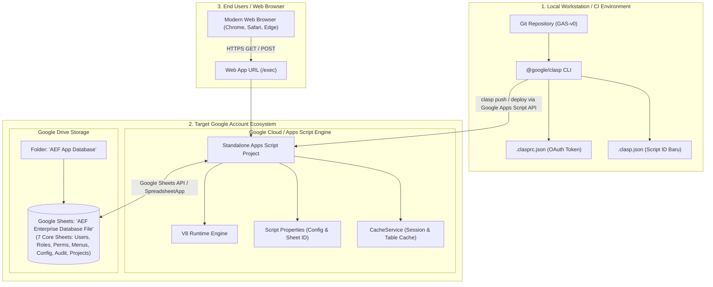
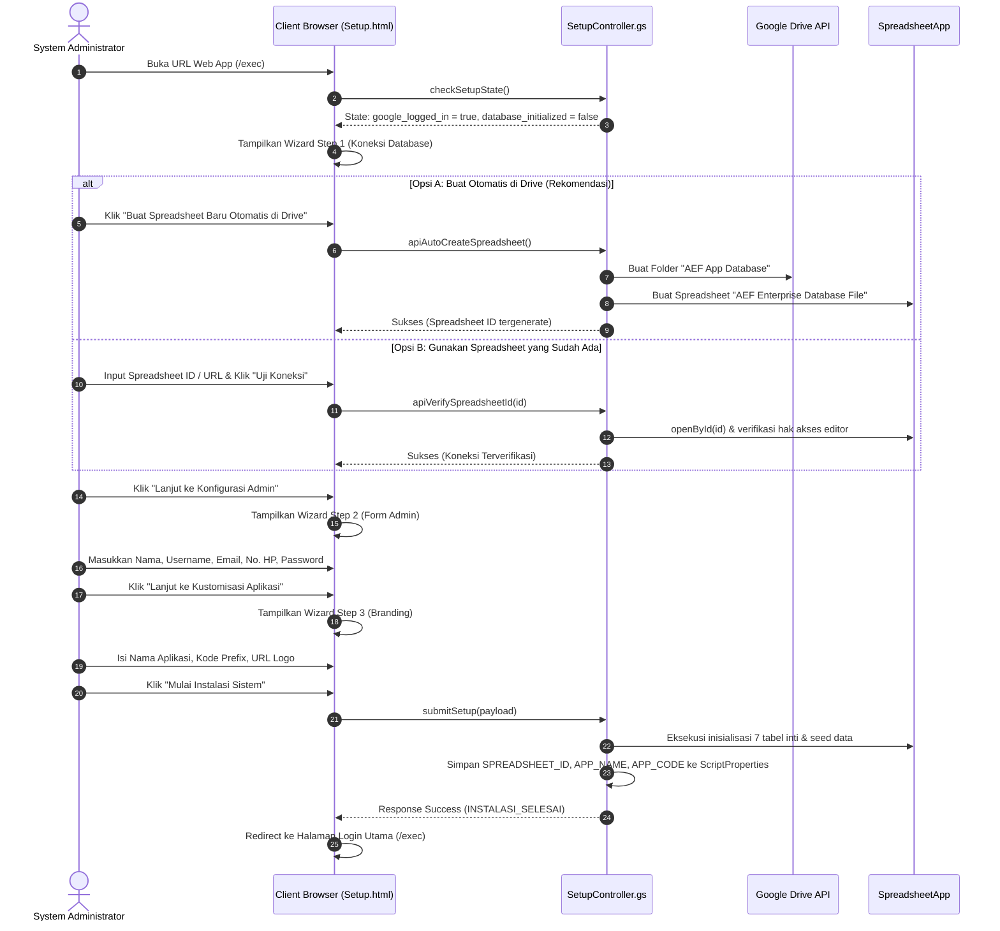

# Product Requirement Document (PRD)
## Implementasi & Deployment Aplikasi ke Akun Google Baru
### AppScript Enterprise Framework (AEF)

---

## 1. INFORMASI DOKUMEN & RINGKASAN EKSEKUTIF

| Atribut | Keterangan |
| :--- | :--- |
| **Judul Dokumen** | PRD Implementasi & Deployment AEF ke Akun Google Baru |
| **Versi Dokumen** | v1.0.0 |
| **Target Audience** | Software Engineer, DevOps Engineer, Cloud/System Administrator, IT Implementer |
| **Status Dokumen** | Approved for Implementation |
| **Framework Basis** | AppScript Enterprise Framework (AEF) v1.0 |
| **Teknologi Utama** | Google Apps Script (V8), Google Sheets DB, HTML5/Bootstrap 5 (Metronic Theme), Clasp CLI |

### 1.1 Ringkasan Eksekutif
Dokumen ini merupakan panduan spesifikasi dan kebutuhan teknis end-to-end untuk mengimplementasikan dan menggelar (*deploy*) sistem **AppScript Enterprise Framework (AEF)** ke dalam **Akun Google yang benar-benar baru** (baik akun perorangan `@gmail.com` maupun akun organisasi *Google Workspace*). 

Panduan ini mencakup seluruh siklus implementasi: mulai dari persiapan lingkungan (*prerequisites*), kloning repositori kode sumber, autentikasi Clasp, provisioning container Apps Script baru, deployment Web App produksi, inisialisasi skema database melalui *System Setup Wizard*, hingga verifikasi fungsional dan tata kelola pemeliharaan berkelanjutan tanpa merusak data (*zero data loss*).

---

## 2. ARSITEKTUR SISTEM & TOPOLOGI DEPLOYMENT



---

## 3. PRASYARAT & PERSIAPAN LINGKUNGAN (PHASE 0)

Sebelum proses deployment dilakukan pada akun Google baru, persiapkan prasyarat berikut:

### 3.1 Kebutuhan Akun Google Baru
1. **Akun Google Aktif**: Akun Gmail personal (`nama@gmail.com`) atau akun Google Workspace (`admin@perusahaan.com`).
2. **Kapasitas Google Drive**: Tersedia ruang penyimpanan kosong minimal 50 MB di Google Drive.
3. **Aktivasi Google Apps Script API**:
   - Masuk ke portal: [https://script.google.com/home/usersettings](https://script.google.com/home/usersettings) menggunakan akun Google tujuan.
   - Ubah toggle **Google Apps Script API** ke posisi **ON** (Aktif).
   > [!IMPORTANT]
   > Jika Google Apps Script API tidak diaktifkan, perintah `clasp push` dan `clasp deploy` akan ditolak dengan pesan error `Google Apps Script API has not been used in project... or it is disabled`.

### 3.2 Kebutuhan Komputer Lokal (Local Machine)
1. **Node.js**: Versi `>= 18.0.0` (LTS direkomendasikan).
2. **NPM / NPX**: Terpasang otomatis bersama Node.js.
3. **Google Clasp CLI**: Terpasang global atau dapat dijalankan via `npx @google/clasp`.
4. **Git CLI**: Untuk kloning repositori source code.

---

## 4. LANGKAH IMPLEMENTASI KE AKUN BARU (PHASE 1 - 4)

### 4.1 Tahap 1: Kloning Repositori & Autentikasi Clasp

1. **Kloning Repositori dari GitHub**:
   ```bash
   git clone https://github.com/achnurdin06/GAS-v0.git aef-new-deployment
   cd aef-new-deployment
   ```

2. **Logout dari Sesi Clasp Lama (Jika Ada)**:
   ```bash
   npx @google/clasp logout
   ```

3. **Login Menggunakan Akun Google Baru**:
   ```bash
   npx @google/clasp login
   ```
   - Browser akan terbuka meminta izin OAuth.
   - **Pilih Akun Google Baru** yang akan menjadi pemilik (*owner*) sistem AEF.
   - Setujui seluruh izin akses yang diminta (Google Apps Script API, Google Drive, Spreadsheets).
   - Terminal akan menampilkan konfirmasi: `Logged in! You may now close this page.`

---

### 4.2 Tahap 2: Pembuatan Kontainer Apps Script Baru

Untuk akun Google baru, buat project Apps Script baru di akun tersebut:

1. **Eksekusi Pembuatan Project**:
   ```bash
   npx @google/clasp create --title "AEF Enterprise Portal" --type webapp --rootDir src
   ```
2. Perintah ini akan:
   - Menghasilkan file `.clasp.json` yang berisi **`scriptId` baru** milik akun tersebut.
   - Menghubungkan direktori lokal `src/` dengan cloud script project baru.

3. **Pastikan Konfigurasi `.clasp.json` Sesuai**:
   Periksa file `.clasp.json`:
   ```json
   {
     "scriptId": "SCRIPT_ID_BARU_YANG_TERGENERATE",
     "rootDir": "src",
     "scriptExtensions": [".js", ".gs"],
     "htmlExtensions": [".html"],
     "jsonExtensions": [".json"],
     "filePushOrder": [
       "src/core/Utils.gs",
       "src/core/Response.gs",
       "src/core/Logger.gs",
       "src/repositories/BaseRepository.gs",
       "src/repositories/AuditRepository.gs",
       "src/repositories/ConfigRepository.gs",
       "src/repositories/MenuRepository.gs",
       "src/repositories/PermissionRepository.gs",
       "src/repositories/RoleRepository.gs",
       "src/repositories/UserRepository.gs",
       "src/repositories/ProjectRepository.gs",
       "src/services/AuditService.gs",
       "src/services/AuthService.gs",
       "src/services/MenuService.gs",
       "src/services/UserService.gs",
       "src/services/RoleService.gs",
       "src/services/PermissionService.gs",
       "src/services/ConfigService.gs",
       "src/services/ProjectService.gs",
       "src/services/DashboardService.gs",
       "src/controllers/MainController.gs",
       "src/controllers/ApiController.gs",
       "src/core/SetupDatabase.gs",
       "src/controllers/SetupController.gs",
       "src/core/Migration.gs"
     ]
   }
   ```

4. **Verifikasi `src/appsscript.json` (Manifest)**:
   Pastikan file manifest di `src/appsscript.json` memiliki pengaturan runtime V8 dan konfigurasi webapp:
   ```json
   {
     "timeZone": "Asia/Jakarta",
     "dependencies": {},
     "exceptionLogging": "STACKDRIVER",
     "runtimeVersion": "V8",
     "webapp": {
       "executeAs": "USER_DEPLOYING",
       "access": "ANYONE"
     }
   }
   ```

---

### 4.3 Tahap 3: Push Kode & Pembuatan Deployment Web App

1. **Push Seluruh Kode ke Google Apps Script Akun Baru**:
   ```bash
   npx @google/clasp push -f
   ```
   - Pastikan seluruh file (41 files mencakup Controllers, Repositories, Services, Views HTML, dan CSS/JS) terunggah tanpa error.

2. **Buat Versi Immutable Pertama**:
   ```bash
   npx @google/clasp version "v1.0.0 - Initial Production Deployment"
   ```
   *Catatan: Sistem akan mengembalikan nomor versi (contoh: `Created version 1`).*

3. **Deploy Web App ke Produksi**:
   ```bash
   npx @google/clasp deploy --versionNumber 1 --description "Production Deployment v1.0"
   ```
   *Terminal akan mencetak ID Deployment, contoh: `Deployed AKfycbx... @1`.*

4. **Dapatkan URL Web App**:
   Jalankan:
   ```bash
   npx @google/clasp open --webapp
   ```
   Atau buka URL dengan format:
   `https://script.google.com/macros/s/<DEPLOYMENT_ID>/exec`

---

### 4.4 Tahap 4: Inisialisasi Database via System Setup Wizard

Saat Web App pertama kali dibuka di browser, sistem mendeteksi bahwa belum ada database yang terhubung (`ScriptProperties.getProperty('SPREADSHEET_ID') === null`). Aplikasi secara otomatis mengarahkan pengguna ke **System Setup Wizard**:



---

## 5. SPESIFIKASI SKEMA & DATA AWAL STANDAR (GENESIS DATA)

Proses inisialisasi pada akun baru secara deterministik membentuk **7 Tabel Inti** dengan struktur kolom dan data awal sebagai berikut:

### 5.1 Tabel `mst_user`
- **Tujuan**: Menyimpan akun pengguna, hash password, status akun, dan tautan role.
- **Struktur Kolom**:
  `id`, `name`, `email`, `username`, `password_hash`, `salt`, `role_id`, `status`, `phone_number`, `profile_pic_url`, `two_factor_secret`, `two_factor_enabled`, `last_login_at`, `created_at`, `created_by`, `updated_at`, `updated_by`
- **Seed Data Otomatis**:
  1. Akun **Super Administrator** (dari isian form Wizard Step 2, role: `ROLE_SUPER_ADMIN`).
  2. Akun cadangan **Administrator Sistem** (`admin@aef.com`, username: `sysadmin`, role: `ROLE_ADMIN`).
  3. Akun demo **Standard User** (`user@aef.com`, username: `userdemo`, role: `ROLE_USER`).

### 5.2 Tabel `mst_role`
- **Tujuan**: Mendefinisikan tingkatan hak akses berbasis Role-Based Access Control (RBAC).
- **Struktur Kolom**:
  `id`, `role_name`, `description`, `is_active`, `created_at`, `created_by`, `updated_at`, `updated_by`
- **Seed Data**:
  - `ROLE_SUPER_ADMIN`: Hak akses absolut ke seluruh sistem dan konfigurasi.
  - `ROLE_ADMIN`: Pengelola operasional dan master data.
  - `ROLE_USER`: Pengguna operasional dengan hak baca dan transaksi terbatas.

### 5.3 Tabel `mst_permission`
- **Tujuan**: Matriks izin granular yang dipetakan ke role.
- **Struktur Kolom**:
  `id`, `role_id`, `permission_code`, `created_at`
- **Seed Data Granular**:
  - `DASHBOARD_VIEW`
  - `USER_VIEW`, `USER_CREATE`, `USER_UPDATE`, `USER_DELETE`
  - `ROLE_VIEW`, `ROLE_CREATE`, `ROLE_UPDATE`, `ROLE_DELETE`
  - `PERMISSION_VIEW`, `PERMISSION_MANAGE`
  - `MENU_VIEW`, `MENU_CREATE`, `MENU_UPDATE`, `MENU_DELETE`
  - `CONFIG_VIEW`, `CONFIG_UPDATE`
  - `AUDIT_VIEW`, `AUDIT_EXPORT`
  - `PROJECT_VIEW`, `PROJECT_CREATE`, `PROJECT_UPDATE`, `PROJECT_DELETE`

### 5.4 Tabel `mst_menu`
- **Tujuan**: Mengontrol rendering menu sidebar dinamis dan hirarki navigasi SPA.
- **Struktur Kolom**:
  `id`, `name`, `code`, `route`, `icon`, `parent_id`, `order_index`, `is_active`, `required_permission`, `created_at`, `created_by`, `updated_at`, `updated_by`
- **Seed Data Hirarki**:
  - Root: **Dashboard** (`/dashboard`, icon: `bi-grid-fill`)
  - Parent: **Master Data** (`MODULE_MASTER_DATA`, icon: `bi-folder-fill`)
    - Submenu: **Manajemen Pengguna** (`/users`, icon: `bi-people-fill`)
    - Submenu: **Manajemen Role** (`/roles`, icon: `bi-shield-lock-fill`)
    - Submenu: **Manajemen Hak Akses** (`/permissions`, icon: `bi-key-fill`)
    - Submenu: **Master Proyek** (`/projects`, icon: `bi-kanban-fill`)
  - Parent: **Pengaturan Sistem** (`MODULE_SYSTEM`, icon: `bi-gear-fill`)
    - Submenu: **Manajemen Menu** (`/menus`, icon: `bi-list-ul`)
    - Submenu: **Konfigurasi Aplikasi** (`/config`, icon: `bi-sliders`)
    - Submenu: **Audit Log** (`/audit`, icon: `bi-journal-text`)

### 5.5 Tabel `sys_configuration`
- **Tujuan**: Konfigurasi dinamis sistem yang dapat diubah administrator tanpa deploy ulang.
- **Seed Parameters**:
  - `SESSION_TIMEOUT_MINUTES`: `60` (Waktu sesi sebelum idle logout).
  - `ENABLE_AUDIT_LOG`: `TRUE` (Pencatatan riwayat transaksi).
  - `DEFAULT_ROLE`: `ROLE_USER` (Role default untuk pendaftaran akun baru).
  - `APP_VERSION`: `1.0.0`
  - `MAX_LOGIN_ATTEMPTS`: `5` (Proteksi brute-force).

### 5.6 Tabel `log_audit`
- **Tujuan**: Menyimpan jejak audit (*audit trail*) yang tidak dapat diubah (*tamper-evident*).
- **Struktur Kolom**:
  `id`, `timestamp`, `actor_id`, `module`, `action`, `status`, `ip_address`, `details`

### 5.7 Tabel `mst_project`
- **Tujuan**: Modul manajemen proyek, anggaran, dan pemantauan timeline.
- **Struktur Kolom**:
  `id`, `project_code`, `project_name`, `client_name`, `project_manager`, `start_date`, `end_date`, `budget`, `priority`, `status`, `progress`, `description`, `created_at`, `created_by`, `updated_at`, `updated_by`
- **Seed Data**: 4 Proyek Enterprise standar (`Implementasi Core ERP`, `Pengembangan Mobile Banking`, `Audit Keamanan Siber`, `Infrastruktur Cloud Hybrid`).

---

## 6. TESTING & ACCEPTANCE CRITERIA PASCA-IMPLEMENTASI

Setelah proses instalasi selesai, Administrator wajib melakukan checklist verifikasi penerimaan sistem (*User Acceptance Testing*):

| No | Modul / Skenario Uji | Tindakan Pengujian | Kriteria Keberhasilan (Pass Criteria) | Status |
| :---: | :--- | :--- | :--- | :---: |
| 1 | **Login Super Admin** | Masukkan username/email & password yang dibuat pada Wizard Step 2. | Login berhasil, token session tersimpan di localStorage, dialihkan ke `/dashboard`. | [ ] |
| 2 | **Branding Aplikasi** | Periksa logo, judul aplikasi di navbar & tab browser. | Judul dan logo sesuai dengan isian Wizard Step 3. | [ ] |
| 3 | **Navigasi Sidebar** | Klik setiap menu di sidebar (Users, Roles, Perms, Projects, Menus, Config, Audit). | Halaman berpindah secara instan (SPA) tanpa reload penuh dan tanpa error JavaScript. | [ ] |
| 4 | **Master Proyek (Read)** | Buka menu `/projects`. | Tabel proyek langsung memuat 4 sample data proyek beserta kartu statistik metrik (tidak ada infinite spinner). | [ ] |
| 5 | **Master Proyek (CRUD)** | Tambah proyek baru, edit nama proyek, lihat modal detail, dan uji hapus. | Data tersimpan langsung ke sheet `mst_project`, toast notifikasi muncul, dan tabel ter-refresh. | [ ] |
| 6 | **Manajemen Menu** | Tambah menu baru via `/menus`. | Menu langsung muncul di sidebar secara real-time tanpa perlu refresh halaman. | [ ] |
| 7 | **Audit Trail** | Buka menu `/audit`. | Seluruh aktivitas login dan CRUD terekam dengan timestamp akurat dan actor ID yang tepat. | [ ] |
| 8 | **Idle Timeout** | Diamkan sesi aplikasi selama waktu timeout (atau trigger `AEF.showIdleLogoutModal()`). | Aplikasi otomatis mengunci layar dan meminta login ulang demi keamanan. | [ ] |

---

## 7. PROSEDUR PEMELIHARAAN & CI/CD BERKELANJUTAN

### 7.1 Cara Melakukan Update Kode Tanpa Merusak Data Operasional
Ketika tim developer merilis pembaruan kode dari GitHub ke akun Google produksi:
1. Lakukan `git pull origin main` di repositori lokal.
2. Jalankan `npx @google/clasp push -f`.
3. Buat versi baru: `npx @google/clasp version "Pembaruan fitur X"`.
4. Perbarui deployment aktif:
   ```bash
   npx @google/clasp deploy -i <DEPLOYMENT_ID> -V <NOMOR_VERSI_BARU> -d "Update deskripsi"
   ```
5. **Jaminan Zero Data Loss**: Seluruh data operasional di Google Sheets tetap aman karena kode script terpisah secara arsitektural dari lembar data (*separation of code and state*).

### 7.2 Prosedur Backup & Disaster Recovery
1. **Google Drive Native Backup**: Google Sheets secara otomatis menyimpan riwayat revisi (*Version History*).
2. **Scheduled Snapshot**: Administrator dapat membuat salinan file spreadsheet secara berkala dengan mengklik menu *File > Make a copy* di Google Sheets atau mengatur trigger otomatis Google Drive.

---

## 8. MATRIX PENANGANAN KENDALA (TROUBLESHOOTING)

| Pesan Kendala / Error | Akar Masalah | Solusi Cepat |
| :--- | :--- | :--- |
| `Google haven't verified this app` (Layar Peringatan Google saat pertama buka) | Aplikasi Apps Script baru belum diverifikasi secara publik oleh Google. | Klik **Advanced (Lanjutan)** pada layar peringatan Google, lalu klik tautan **Go to AEF Enterprise Portal (unsafe) / Buka aplikasi (tidak aman)**. Hal ini aman karena script dibuat dan dijalankan di akun Anda sendiri. |
| `Apps Script API has not been used... or disabled` saat clasp push | API Apps Script belum diaktifkan pada akun Google baru. | Buka [https://script.google.com/home/usersettings](https://script.google.com/home/usersettings), ubah toggle ke posisi **ON**, lalu jalankan kembali perintah push. |
| `ReferenceError: verifySpreadsheetConnection is not defined` | Tag script browser mengevaluasi sebelum fungsi selesai terikat ke `window`. | Pastikan menggunakan codebase versi rilis terbaru yang telah memetakan fungsi setup ke global `window.*`. |
| `Content unavailable. Resource was not cached` di Chrome DevTools | DevTools dibuka setelah redirect atau browser tidak mencache iframe dinamis Apps Script. | Lakukan **Hard Refresh** (`Cmd + Shift + R` atau `Ctrl + F5`) pada browser, atau gunakan mode Incognito. |
| Tombol UI tidak merespons setelah deployment versi baru | Browser masih menyimpan cache aset HTML/JS versi deployment lama. | Pastikan redeploy clasp menggunakan `-V <versi_terbaru>` dan lakukan hard reload browser. |
